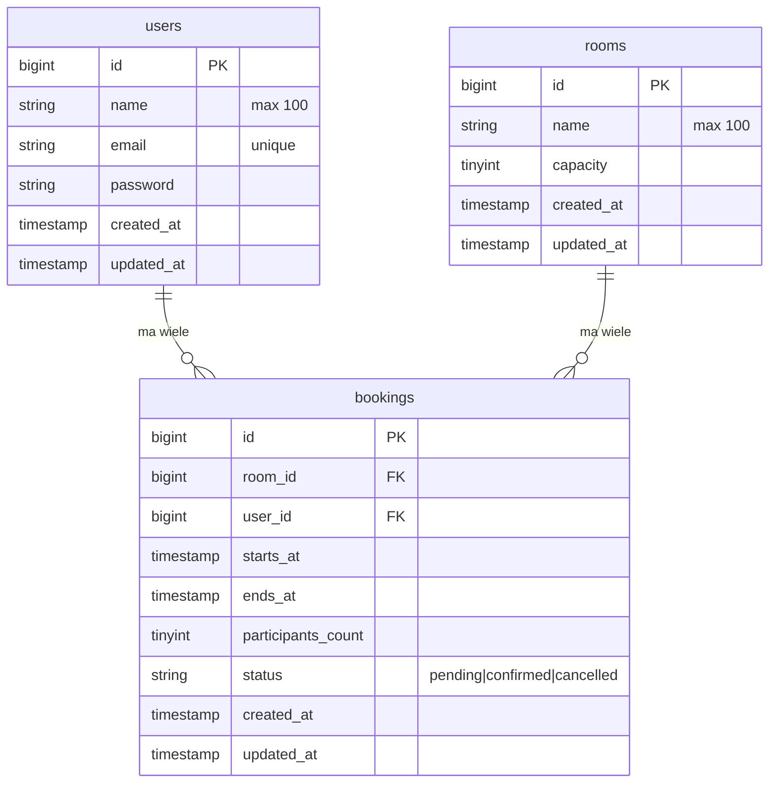

> English version: [README.md](README.md)

# RoomBook

[](https://php.net)
[](https://laravel.com)
[](https://vuejs.org)
[](https://www.typescriptlang.org)
[](#uruchamianie-testów)
[](https://phpstan.org)

System rezerwacji sal konferencyjnych — zadanie rekrutacyjne. Laravel 12 REST API + Vue 3 SPA.

---

## O projekcie

RoomBook to fullstackowy system rezerwacji sal konferencyjnych zbudowany jako zadanie rekrutacyjne. Użytkownicy mogą się rejestrować, przeglądać dostępne sale, tworzyć rezerwacje na wybrany przedział czasowy i anulować własne rezerwacje.

Backend to bezstanowe REST API zbudowane w Laravel 12. Frontend to aplikacja jednostronicowa (SPA) napisana w Vue 3 z TypeScript. Oba komponenty komunikują się wyłącznie przez JSON po HTTP — bez Blade, bez Inertia.

Logika rezerwacji jest chroniona przez czterostopniowy pipeline walidacji, który uruchamia walidatory od najtańszego do najdroższego: kolejność dat, blokada rezerwacji w przeszłości, sprawdzenie pojemności i zapytanie o kolizję z pesymistycznym lockiem — zabezpieczenie przed race condition przy jednoczesnych żądaniach.

---

## Stack technologiczny

**Backend**

- **PHP** 8.2
- **Laravel** 12 (szkielet API-only)
- **MySQL** 8.0
- **Laravel Sanctum** — autentykacja tokenowa (token w localStorage)
- **Laravel Sail** — Docker (PHP-FPM + MySQL, bez Redisa)

**Frontend**

- **Vue 3** — Composition API, `<script setup>`
- **TypeScript** 5
- **Tailwind CSS** v4 (konfiguracja przez CSS, blok `@theme {}`)
- **Pinia** — store auth
- **Axios** — klient HTTP z interceptorami
- **Vite** — bundler

**Jakość kodu**

- **PestPHP** — 21 testów feature, 38 asercji
- **PHPStan / Larastan** — poziom 6, zero błędów, bez baseline
- **Laravel Pint** — styl kodu PSR-12
- **GitHub Actions** — CI/CD (testy, PHPStan, Pint przy każdym pushu)

---

## Architektura

### Cykl żądania

```
Żądanie HTTP
  → FormRequest (walidacja typów i formatów)
  → Controller (cienki — tworzy DTO, wywołuje serwis)
  → BookingData DTO (separuje warstwę HTTP od logiki biznesowej)
  → BookingService (orkiestrator)
  → BookingValidationPipeline (Chain of Responsibility)
  → Model Eloquent
  → Odpowiedź JSON
```

### Wzorce projektowe

**Chain of Responsibility — pipeline walidacji rezerwacji**
`BookingValidationPipeline` uruchamia 4 walidatory po kolei, zatrzymując się na pierwszym niepowodzeniu:

```
DateOrderValidator → FutureDateValidator → RoomCapacityValidator → AvailabilityValidator
  (pamięć)              (pamięć)               (1 zapytanie)       (zapytanie + lockForUpdate)
```

Każdy walidator implementuje `BookingValidatorInterface`. Kolejność wykonania jest zdefiniowana w `AppServiceProvider`, a nie zakodowana na stałe w pipeline — dodanie lub przestawienie walidatora nie wymaga zmian w `BookingValidationPipeline`.

**DTO — BookingData**
Klasa `final readonly` tworzona przez `BookingData::fromRequest()`. Przechowuje typowane instancje Carbon i liczby całkowite zamiast surowych stringów z requestu, izolując warstwę serwisową od warstwy HTTP.

**Policy — BookingPolicy**
`BookingPolicy::cancel()` sprawdza `$user->id === $booking->user_id`, chroniąc przed atakiem IDOR gdzie użytkownik mógłby anulować czyjąś rezerwację.

**Eloquent Scopes**

- `scopeActive()` — wyklucza anulowane rezerwacje
- `scopeOverlapping(Carbon $start, Carbon $end)` — wyszukuje rezerwacje nakładające się na dany przedział, używając ścisłych operatorów `<` / `>` (sąsiadujące rezerwacje 09:00–11:00 i 11:00–13:00 nie kolidują)

**Zabezpieczenie przed race condition**
`AvailabilityValidator` działa wewnątrz `DB::transaction()` z `lockForUpdate()` na zapytaniu o konflikt — zapobiega podwójnej rezerwacji tego samego terminu przez dwa równoczesne żądania.

---

## Struktura projektu

```
roombook/
├── app/
│   ├── DataTransferObjects/
│   │   └── BookingData.php          # final readonly DTO
│   ├── Enums/
│   │   └── BookingStatus.php        # PHP enum ze string-backing
│   ├── Http/
│   │   ├── Controllers/             # AuthController, BookingController, RoomController
│   │   └── Requests/                # RegisterRequest, LoginRequest, StoreBookingRequest
│   ├── Models/                      # User, Room, Booking (scope'y, relacje, casty)
│   ├── Policies/
│   │   └── BookingPolicy.php
│   └── Services/Booking/
│       ├── BookingService.php       # orkiestrator: store, cancel, getForUser
│       ├── BookingValidationPipeline.php
│       ├── Contracts/
│       │   └── BookingValidatorInterface.php
│       └── Validators/              # DateOrder, FutureDate, RoomCapacity, Availability
├── database/
│   ├── migrations/
│   └── seeders/                     # 5 sal, demo użytkownik z 4 rezerwacjami
├── tests/Feature/
│   ├── Auth/AuthTest.php            # 6 testów
│   ├── Booking/
│   │   ├── StoreBookingTest.php     # 6 testów
│   │   ├── CancelBookingTest.php    # 3 testy
│   │   └── ListBookingTest.php      # 1 test
│   └── Room/RoomTest.php            # 2 testy
├── .github/workflows/               # tests.yml, phpstan.yml, pint.yml
└── frontend/
    ├── src/
    │   ├── api/axios.ts             # instancja Axios z interceptorami
    │   ├── composables/             # useAuth, useBookings, useRooms, useBookingForm, useDateTime
    │   ├── components/
    │   │   ├── auth/                # LoginForm, RegisterForm
    │   │   ├── base/                # BaseButton, BaseInput, BaseAlert
    │   │   ├── booking/             # BookingRow, BookingSummary, StatusBadge
    │   │   ├── layout/              # Navbar
    │   │   ├── room/                # RoomCard
    │   │   └── sections/            # SectionHeader
    │   ├── stores/auth.ts           # Pinia store autentykacji
    │   ├── styles/                  # app.css, theme.css (Tailwind @theme), globals.css
    │   ├── types/index.ts
    │   └── views/                   # AuthView, RoomsView, BookingCreateView, BookingsView
    └── vite.config.ts
```

---

## Schemat bazy danych



**Indeksy na tabeli bookings:** kompozytowy `(room_id, starts_at, ends_at)` dla zapytań o kolizję oraz `(user_id)` dla listowania rezerwacji użytkownika.

---

## Uruchomienie

**Wymagania:** Docker + Docker Compose, Node.js 20+.

**1. Sklonuj i skonfiguruj**

```bash
git clone https://github.com/MKabaja/RoomBook.git
cd RoomBook
cp .env.example .env
cd frontend && cp .env.example .env && cd ..
```

**2. Uruchom kontenery**

```bash
./vendor/bin/sail up -d
```

**3. Zainicjalizuj aplikację**

```bash
./vendor/bin/sail artisan key:generate
./vendor/bin/sail artisan migrate --seed
```

**4. Uruchom frontend**

```bash
cd frontend
npm install
npm run dev
```

**5. Weryfikacja**

- Frontend: `http://localhost:5174`
- API: `http://localhost:8000/api`

```bash
./vendor/bin/sail composer check   # Pint + PHPStan + Pest
```

---

## Konto demo

Tworzone przez `sail artisan migrate --seed`.

| Email              | Hasło      |
| ------------------ | ---------- |
| `test@example.com` | `password` |

Konto demo ma 4 wstępnie utworzone rezerwacje w różnych statusach (pending, confirmed, cancelled).

**Sale dostępne po seedowaniu:**

| Sala                 | Pojemność |
| -------------------- | --------- |
| Sala Konferencyjna A | 12        |
| Sala Spotkań B       | 6         |
| Sala Szkoleniowa C   | 30        |
| Sala Zarządu D       | 8         |
| Sala Kreatywna E     | 15        |

---

## Zmienne środowiskowe

Główny plik `.env`:

| Zmienna        | Opis                                            |
| -------------- | ----------------------------------------------- |
| `APP_KEY`      | Generowany przez `php artisan key:generate`     |
| `DB_HOST`      | `mysql` (nazwa serwisu Sail)                    |
| `DB_DATABASE`  | `roombook`                                      |
| `DB_USERNAME`  | `sail`                                          |
| `DB_PASSWORD`  | `password`                                      |
| `FRONTEND_URL` | Dozwolone origin CORS — `http://localhost:5174` |

`frontend/.env`:

| Zmienna        | Opis                        |
| -------------- | --------------------------- |
| `VITE_API_URL` | `http://localhost:8000/api` |

---

## Dokumentacja API

Wszystkie chronione endpointy wymagają nagłówka `Authorization: Bearer <token>`. Token jest zwracany przy logowaniu i przechowywany w `localStorage` przez frontend.

Bazowy URL: `http://localhost:8000/api`

### Autentykacja

| Metoda | Ścieżka     | Auth | Opis                            |
| ------ | ----------- | ---- | ------------------------------- |
| POST   | `/register` | —    | Rejestracja nowego konta        |
| POST   | `/login`    | —    | Logowanie, zwraca token         |
| POST   | `/logout`   | ✓    | Unieważnienie aktualnego tokenu |

#### `POST /register`

| Pole                    | Typ    | Wymagane | Uwagi              |
| ----------------------- | ------ | -------- | ------------------ |
| `name`                  | string | ✓        | max 100 znaków     |
| `email`                 | string | ✓        | unikalny, poprawny |
| `password`              | string | ✓        | min 8 znaków       |
| `password_confirmation` | string | ✓        | musi być zgodny    |

**Odpowiedź 201:**

```json
{
    "token": "1|abc...",
    "user": { "id": 1, "name": "Jan Kowalski", "email": "jan@example.com" }
}
```

**Błędy:** `422` Walidacja nie przeszła

#### `POST /login`

| Pole       | Typ    | Wymagane |
| ---------- | ------ | -------- |
| `email`    | string | ✓        |
| `password` | string | ✓        |

**Odpowiedź 200:** taka sama struktura jak przy `/register`

**Błędy:** `401` Złe dane logowania | `422` Walidacja nie przeszła

#### `POST /logout`

**Odpowiedź 204** (brak treści)

---

### Sale

| Metoda | Ścieżka  | Auth | Opis                 |
| ------ | -------- | ---- | -------------------- |
| GET    | `/rooms` | ✓    | Lista wszystkich sal |

**Odpowiedź 200:**

```json
[
    { "id": 1, "name": "Sala Konferencyjna A", "capacity": 12 },
    { "id": 2, "name": "Sala Spotkań B", "capacity": 6 }
]
```

---

### Rezerwacje

| Metoda | Ścieżka                 | Auth | Opis                                      |
| ------ | ----------------------- | ---- | ----------------------------------------- |
| GET    | `/bookings`             | ✓    | Lista rezerwacji zalogowanego użytkownika |
| POST   | `/bookings`             | ✓    | Utwórz rezerwację                         |
| PATCH  | `/bookings/{id}/cancel` | ✓    | Anuluj rezerwację (tylko własną)          |

#### `GET /bookings`

Zwraca paginowaną listę (15/stronę) rezerwacji zalogowanego użytkownika, posortowanych od najnowszych, z danymi sali (eager loading).

**Odpowiedź 200:**

```json
{
    "current_page": 1,
    "data": [
        {
            "id": 1,
            "room_id": 1,
            "starts_at": "2026-06-17T09:00:00.000000Z",
            "ends_at": "2026-06-17T11:00:00.000000Z",
            "participants_count": 5,
            "status": "pending",
            "room": { "id": 1, "name": "Sala Konferencyjna A", "capacity": 12 }
        }
    ],
    "last_page": 1,
    "per_page": 15,
    "total": 1
}
```

#### `POST /bookings`

| Pole                 | Typ     | Wymagane | Uwagi                            |
| -------------------- | ------- | -------- | -------------------------------- |
| `room_id`            | integer | ✓        | musi istnieć                     |
| `starts_at`          | string  | ✓        | ISO 8601, musi być w przyszłości |
| `ends_at`            | string  | ✓        | ISO 8601, musi być po starts_at  |
| `participants_count` | integer | ✓        | min 1                            |

Reguły biznesowe sprawdzane po kolei:

1. `ends_at` musi być po `starts_at`
2. `starts_at` musi być w przyszłości
3. `participants_count` nie może przekraczać `room.capacity`
4. Przedział czasowy nie może kolidować z istniejącą aktywną rezerwacją

**Odpowiedź 201:** Pełny obiekt rezerwacji z relacją room.

**Błędy:** `422` z polem `errors` zawierającym komunikaty per pole.

#### `PATCH /bookings/{id}/cancel`

**Odpowiedź 200:** Zaktualizowany obiekt rezerwacji ze statusem `"cancelled"`.

**Błędy:** `403` Próba anulowania cudzej rezerwacji | `422` Rezerwacja już anulowana

---

### Format błędów

| Status | Struktura                                             | Kiedy                                  |
| ------ | ----------------------------------------------------- | -------------------------------------- |
| `401`  | `{ "message": "Unauthenticated." }`                   | Brak lub nieważny token                |
| `403`  | `{ "message": "This action is unauthorized." }`       | Nie przeszła weryfikacja Policy (IDOR) |
| `404`  | `{ "message": "Not Found." }`                         | Zasób nie istnieje                     |
| `422`  | `{ "message": "...", "errors": { "pole": ["..."] } }` | Błąd walidacji lub reguły biznesowej   |

---

## Decyzje techniczne

**Token w localStorage zamiast httpOnly cookie**
Sanctum obsługuje dwa tryby: SPA cookie mode (httpOnly, bezpieczny na XSS) i token mode (prostszy). W ramach scope zadania rekrutacyjnego wybrano token mode, żeby skupić się na logice rezerwacji. Tradeoff opisany w sekcji [Co bym poprawił](#co-bym-poprawił).

**Chain of Responsibility od najtańszego do najdroższego**
Najpierw porównania w pamięci, potem jedno zapytanie sprawdzające pojemność, na końcu drogie zapytanie z lockiem. Niepowodzenie na dowolnym etapie zatrzymuje łańcuch — bez zbędnych trafień w bazę.

**Scope `overlapping` używa ścisłych nierówności**
`starts_at < $end AND ends_at > $start` — dwie rezerwacje dzielące tylko krawędź (09:00–11:00 i 11:00–13:00) nie kolidują. Sala staje się dostępna dokładnie w momencie zakończenia rezerwacji.

**Bez API Resources (JsonResource)**
Przy trzech prostych modelach i braku potrzeby warunkowego wyłączania pól lub przemianowania, warstwa JsonResource dodaje abstrakcję bez wartości. Modele są zwracane bezpośrednio.

---

## Uruchamianie testów

```bash
./vendor/bin/sail composer test
```

21 testów, 38 asercji. Wszystkie testy feature działają na prawdziwej bazie MySQL — bez SQLite, bez mocków.

| Plik                        | Testy | Pokrycie                                                                              |
| --------------------------- | ----- | ------------------------------------------------------------------------------------- |
| `Auth/AuthTest.php`         | 6     | Rejestracja, logowanie, wylogowanie, 401 na chronionych trasach                       |
| `Booking/StoreBookingTest`  | 6     | Happy path, kolejność dat, przeszłość, pojemność, kolizja, reużycie anulowanego slotu |
| `Booking/CancelBookingTest` | 3     | Anulowanie własnej, cudzej (403), już anulowanej                                      |
| `Booking/ListBookingTest`   | 1     | Użytkownik widzi tylko swoje rezerwacje                                               |
| `Room/RoomTest`             | 2     | Lista z autentykacją, 401 bez tokenu                                                  |

Analiza statyczna — PHPStan poziom 6, zero błędów, bez baseline:

```bash
./vendor/bin/sail composer analyse
```

Styl kodu:

```bash
./vendor/bin/sail composer lint
```

Wszystkie trzy naraz:

```bash
./vendor/bin/sail composer check
```

---

## Co bym poprawił

### Bezpieczeństwo

**Sanctum SPA mode zamiast tokenu w localStorage**

Obecna implementacja używa Sanctum token mode — token jest przechowywany w `localStorage` i dołączany do każdego żądania przez Axios interceptor. Bezpieczniejszym podejściem byłoby przejście na Sanctum SPA mode z httpOnly cookie + CSRF protection, co eliminuje ryzyko XSS. Token w localStorage jest podatny na odczyt przez złośliwy JavaScript; cookie httpOnly jest niedostępny dla skryptów.

### Skalowalność

- **UUID zamiast auto-increment ID** — utrudnienie enumeracji zasobów
- **Constraint `EXCLUDE` w PostgreSQL** jako dodatkowe zabezpieczenie kolizji na poziomie bazy
- **Redis distributed lock** jako solidniejsza alternatywa dla `lockForUpdate()` przy bardzo dużym obciążeniu
- **Cache listingu sal** — sale rzadko się zmieniają; krótki TTL eliminuje powtarzające się zapytania
- **Wersjonowanie API** (`/api/v1/`)

### Jakość kodu

- **API Resources (JsonResource)** — kontrolowana struktura odpowiedzi, łatwiejsza do ewolucji
- **Testy frontendowe** — Vitest + Vue Test Utils dla composable'i i komponentów
- **Testy E2E** — Playwright dla krytycznych przepływów użytkownika (rejestracja → rezerwacja → anulowanie)
- **Dokumentacja OpenAPI / Swagger**
- **Refaktor walidatorów** — wspólna klasa abstrakcyjna `BaseBookingValidator`
  eliminująca powtarzający się pattern `validate()` + `hasConflict()`

### Funkcjonalności

**Real-time availability — Laravel Reverb**

Aktualna wersja wymaga ręcznego odświeżenia strony, żeby zobaczyć zmiany w dostępności sal. Naturalnym rozszerzeniem byłoby dodanie WebSocket broadcasting via Laravel Reverb: gdy użytkownik tworzy lub anuluje rezerwację, event `BookingChanged` byłby broadcastowany do wszystkich aktywnych sesji. Widok dostępności sali aktualizowałby się live bez odświeżania strony.

**Widok kalendarza dostępności**

Zamiast prostej listy rezerwacji — interaktywny kalendarz pokazujący zajętość sali w czasie. Naturalnie współgra z real-time updates przez Reverb: nowe rezerwacje pojawiałyby się na kalendarzu natychmiast po ich utworzeniu przez innego użytkownika.

- **Edycja rezerwacji** — aktualnie obsługiwane jest tylko tworzenie i anulowanie
- **Panel admina** — zarządzanie salami, potwierdzanie statusu rezerwacji
- **Powiadomienia email** — potwierdzenie i anulowanie rezerwacji
