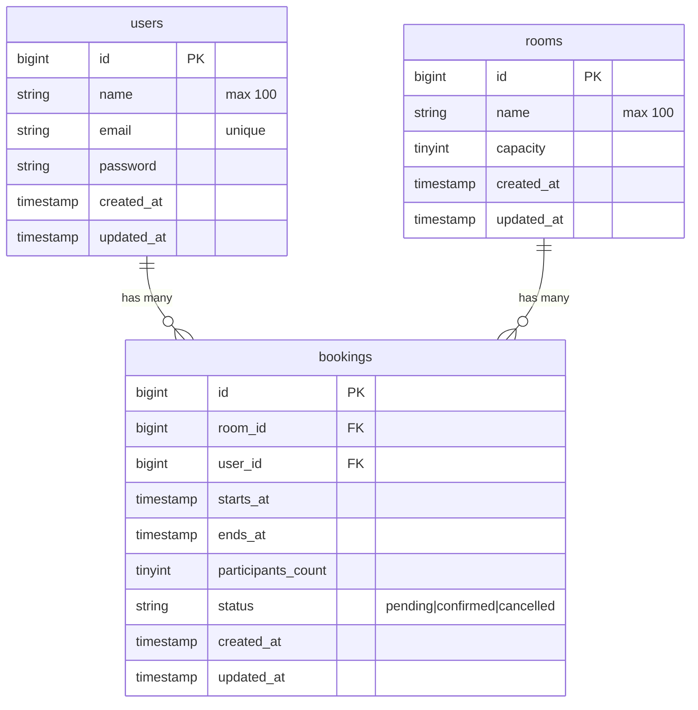

> Polish version available: [README-PL.md](README-PL.md)

# RoomBook

[](https://php.net)
[](https://laravel.com)
[](https://vuejs.org)
[](https://www.typescriptlang.org)
[](#running-tests)
[](https://phpstan.org)

Conference room booking system — recruitment task. Laravel 12 REST API + Vue 3 SPA.

---

## About the Project

RoomBook is a fullstack conference room reservation system built as a recruitment assignment. Users can register, browse available meeting rooms, create bookings for chosen time slots, and cancel their own reservations.

The backend is a stateless REST API built with Laravel 12. The frontend is a single-page application written in Vue 3 with TypeScript. The two communicate exclusively via JSON over HTTP — no Blade, no Inertia.

The core booking logic is protected by a four-step validation pipeline that runs in order from cheapest to most expensive: date ordering, past-date guard, capacity check, and a conflict query with pessimistic locking to prevent race conditions under concurrent requests.

---

## Tech Stack

**Backend**

- **PHP** 8.2
- **Laravel** 12 (API-only skeleton)
- **MySQL** 8.0
- **Laravel Sanctum** — token-based auth (stored in localStorage)
- **Laravel Sail** — Docker (PHP-FPM + MySQL, no Redis)

**Frontend**

- **Vue 3** — Composition API, `<script setup>`
- **TypeScript** 5
- **Tailwind CSS** v4 (CSS-based config via `@theme {}`)
- **Pinia** — auth store
- **Axios** — HTTP client with interceptors
- **Vite** — bundler

**Quality**

- **PestPHP** — 21 feature tests, 38 assertions
- **PHPStan / Larastan** — level 6, zero errors, no baseline
- **Laravel Pint** — PSR-12 code style
- **GitHub Actions** — CI/CD (tests, PHPStan, Pint on every push)

---

## Architecture

### Request lifecycle

```
HTTP Request
  → FormRequest (type/format validation)
  → Controller (thin — creates DTO, calls service)
  → BookingData DTO (separates HTTP layer from business logic)
  → BookingService (orchestration)
  → BookingValidationPipeline (Chain of Responsibility)
  → Eloquent Model
  → JSON Response
```

### Design patterns

**Chain of Responsibility — booking validation**
`BookingValidationPipeline` runs 4 validators in order, stopping on the first failure:

```
DateOrderValidator → FutureDateValidator → RoomCapacityValidator → AvailabilityValidator
   (memory)              (memory)               (1 query)          (query + lockForUpdate)
```

Each validator implements `BookingValidatorInterface`. The execution order is defined in `AppServiceProvider`, not hardcoded in the pipeline — adding or reordering a validator requires no changes to `BookingValidationPipeline`.

**DTO — BookingData**
A `final readonly class` created via `BookingData::fromRequest()`. It carries typed Carbon instances and integers instead of raw request strings, isolating the service layer from HTTP concerns.

**Policy — BookingPolicy**
`BookingPolicy::cancel()` checks `$user->id === $booking->user_id`, preventing IDOR attacks where a user could cancel someone else's reservation.

**Eloquent Scopes**

- `scopeActive()` — excludes cancelled bookings
- `scopeOverlapping(Carbon $start, Carbon $end)` — finds bookings that overlap a given interval using strict `<` / `>` comparisons (adjacent bookings at 09:00–11:00 and 11:00–13:00 do not conflict)

**Race condition protection**
`AvailabilityValidator` runs inside `DB::transaction()` with `lockForUpdate()` on the conflict query, preventing two concurrent requests from double-booking the same slot.

---

## Project Structure

```
roombook/
├── app/
│   ├── DataTransferObjects/
│   │   └── BookingData.php          # final readonly DTO
│   ├── Enums/
│   │   └── BookingStatus.php        # string-backed PHP enum
│   ├── Http/
│   │   ├── Controllers/             # AuthController, BookingController, RoomController
│   │   └── Requests/                # RegisterRequest, LoginRequest, StoreBookingRequest
│   ├── Models/                      # User, Room, Booking (with scopes, relations, casts)
│   ├── Policies/
│   │   └── BookingPolicy.php
│   └── Services/Booking/
│       ├── BookingService.php       # orchestrator: store, cancel, getForUser
│       ├── BookingValidationPipeline.php
│       ├── Contracts/
│       │   └── BookingValidatorInterface.php
│       └── Validators/              # DateOrder, FutureDate, RoomCapacity, Availability
├── database/
│   ├── migrations/
│   └── seeders/                     # 5 rooms, demo user with 4 bookings
├── tests/Feature/
│   ├── Auth/AuthTest.php            # 6 tests
│   ├── Booking/
│   │   ├── StoreBookingTest.php     # 6 tests
│   │   ├── CancelBookingTest.php    # 3 tests
│   │   └── ListBookingTest.php      # 1 test
│   └── Room/RoomTest.php            # 2 tests
├── .github/workflows/               # tests.yml, phpstan.yml, pint.yml
└── frontend/
    ├── src/
    │   ├── api/axios.ts             # Axios instance with interceptors
    │   ├── composables/             # useAuth, useBookings, useRooms, useBookingForm, useDateTime
    │   ├── components/
    │   │   ├── auth/                # LoginForm, RegisterForm
    │   │   ├── base/                # BaseButton, BaseInput, BaseAlert
    │   │   ├── booking/             # BookingRow, BookingSummary, StatusBadge
    │   │   ├── layout/              # Navbar
    │   │   ├── room/                # RoomCard
    │   │   └── sections/            # SectionHeader
    │   ├── stores/auth.ts           # Pinia auth store
    │   ├── styles/                  # app.css, theme.css (Tailwind @theme), globals.css
    │   ├── types/index.ts
    │   └── views/                   # AuthView, RoomsView, BookingCreateView, BookingsView
    └── vite.config.ts
```

---

## Database Schema



**Indexes on bookings:** composite `(room_id, starts_at, ends_at)` for conflict queries, plus `(user_id)` for listing a user's own bookings.

---

## Getting Started

**Prerequisites:** Docker + Docker Compose, Node.js 20+.

**1. Clone and configure**

```bash
git clone https://github.com/MKabaja/RoomBook.git
cd RoomBook
cp .env.example .env
cd frontend && cp .env.example .env && cd ..
```

**2. Install Composer dependencies**

`vendor/` is not committed to the repository — it must be built before starting Sail.

If you have PHP installed locally:

```bash
composer install
```

If you don't have PHP locally, use a one-time Docker container (official Laravel method):

```bash
docker run --rm \
    -u "$(id -u):$(id -g)" \
    -v "$(pwd):/var/www/html" \
    -w /var/www/html \
    laravelsail/php82-composer:latest \
    composer install --ignore-platform-reqs
```

**3. Start containers**

```bash
./vendor/bin/sail up -d
```

**4. Initialize the application**

```bash
./vendor/bin/sail artisan key:generate
./vendor/bin/sail artisan migrate --seed
```

**5. Start the frontend**

```bash
cd frontend
npm install
npm run dev
```

**6. Verify**

- Frontend: `http://localhost:5174`
- API: `http://localhost:8000/api`

```bash
./vendor/bin/sail composer check   # Pint + PHPStan + Pest
```

---

## Demo Account

Seeded by `sail artisan migrate --seed`.

| Email              | Password   |
| ------------------ | ---------- |
| `test@example.com` | `password` |

The demo user has 4 pre-created bookings in different statuses (pending, confirmed, cancelled).

**Rooms available after seeding:**

| Room                 | Capacity |
| -------------------- | -------- |
| Sala Konferencyjna A | 12       |
| Sala Spotkań B       | 6        |
| Sala Szkoleniowa C   | 30       |
| Sala Zarządu D       | 8        |
| Sala Kreatywna E     | 15       |

---

## Environment Variables

Root `.env`:

| Variable       | Description                                   |
| -------------- | --------------------------------------------- |
| `APP_KEY`      | Generated by `php artisan key:generate`       |
| `DB_HOST`      | `mysql` (Sail service name)                   |
| `DB_DATABASE`  | `roombook`                                    |
| `DB_USERNAME`  | `sail`                                        |
| `DB_PASSWORD`  | `password`                                    |
| `FRONTEND_URL` | Allowed CORS origin — `http://localhost:5174` |

`frontend/.env`:

| Variable       | Description                 |
| -------------- | --------------------------- |
| `VITE_API_URL` | `http://localhost:8000/api` |

---

## API Reference

All authenticated endpoints require the `Authorization: Bearer <token>` header. The token is returned on login and stored in `localStorage` by the frontend.

Base URL: `http://localhost:8000/api`

### Authentication

| Method | Path        | Auth | Description                  |
| ------ | ----------- | ---- | ---------------------------- |
| POST   | `/register` | —    | Register a new account       |
| POST   | `/login`    | —    | Login and receive a token    |
| POST   | `/logout`   | ✓    | Invalidate the current token |

#### `POST /register`

| Field                   | Type   | Required | Notes               |
| ----------------------- | ------ | -------- | ------------------- |
| `name`                  | string | ✓        | max 100 chars       |
| `email`                 | string | ✓        | unique, valid email |
| `password`              | string | ✓        | min 8 chars         |
| `password_confirmation` | string | ✓        | must match          |

**Response 201:**

```json
{
    "token": "1|abc...",
    "user": { "id": 1, "name": "Jane Smith", "email": "jane@example.com" }
}
```

**Errors:** `422` Validation failed

#### `POST /login`

| Field      | Type   | Required |
| ---------- | ------ | -------- |
| `email`    | string | ✓        |
| `password` | string | ✓        |

**Response 200:** same shape as `/register`

**Errors:** `401` Wrong credentials | `422` Validation failed

#### `POST /logout`

**Response 204** (no content)

---

### Rooms

| Method | Path     | Auth | Description    |
| ------ | -------- | ---- | -------------- |
| GET    | `/rooms` | ✓    | List all rooms |

**Response 200:**

```json
[
    { "id": 1, "name": "Sala Konferencyjna A", "capacity": 12 },
    { "id": 2, "name": "Sala Spotkań B", "capacity": 6 }
]
```

---

### Bookings

| Method | Path                    | Auth | Description                  |
| ------ | ----------------------- | ---- | ---------------------------- |
| GET    | `/bookings`             | ✓    | List current user's bookings |
| POST   | `/bookings`             | ✓    | Create a booking             |
| PATCH  | `/bookings/{id}/cancel` | ✓    | Cancel a booking (own only)  |

#### `GET /bookings`

Returns paginated list (15/page) of the authenticated user's own bookings, ordered newest first, with room data eager-loaded.

**Response 200:**

```json
{
    "current_page": 1,
    "data": [
        {
            "id": 1,
            "room_id": 1,
            "starts_at": "2026-06-17T09:00:00.000000Z",
            "ends_at": "2026-06-17T11:00:00.000000Z",
            "participants_count": 5,
            "status": "pending",
            "room": { "id": 1, "name": "Sala Konferencyjna A", "capacity": 12 }
        }
    ],
    "last_page": 1,
    "per_page": 15,
    "total": 1
}
```

#### `POST /bookings`

| Field                | Type    | Required | Notes                             |
| -------------------- | ------- | -------- | --------------------------------- |
| `room_id`            | integer | ✓        | must exist                        |
| `starts_at`          | string  | ✓        | ISO 8601, must be in the future   |
| `ends_at`            | string  | ✓        | ISO 8601, must be after starts_at |
| `participants_count` | integer | ✓        | min 1                             |

Business rules validated in order:

1. `ends_at` must be after `starts_at`
2. `starts_at` must be in the future
3. `participants_count` must not exceed `room.capacity`
4. The time slot must not conflict with an existing active booking

**Response 201:** Full booking object with room relation.

**Errors:** `422` with `errors` keyed by field name.

#### `PATCH /bookings/{id}/cancel`

**Response 200:** Updated booking object with `"status": "cancelled"`.

**Errors:** `403` Attempting to cancel another user's booking | `422` Already cancelled

---

### Error Response Format

| Status | Shape                                                  | When                               |
| ------ | ------------------------------------------------------ | ---------------------------------- |
| `401`  | `{ "message": "Unauthenticated." }`                    | Missing or invalid token           |
| `403`  | `{ "message": "This action is unauthorized." }`        | Policy check failed (IDOR)         |
| `404`  | `{ "message": "Not Found." }`                          | Resource does not exist            |
| `422`  | `{ "message": "...", "errors": { "field": ["..."] } }` | Validation or business rule failed |

---

## Technical Decisions

**Token in localStorage instead of httpOnly cookie**
Sanctum supports both SPA cookie mode (httpOnly, XSS-safe) and token mode (simpler setup). Token mode was chosen to keep the scope focused on the core booking logic. The tradeoff is noted in [What I'd improve](#what-id-improve).

**Chain of Responsibility ordered cheapest to most expensive**
In-memory comparisons run first, then a single-query capacity check, then the expensive conflict query with a lock. A failure at any stage stops the chain — no unnecessary database hits.

**Overlapping scope uses strict inequalities**
`starts_at < $end AND ends_at > $start` — two bookings that share only an edge (09:00–11:00 and 11:00–13:00) are not considered conflicting. The room becomes available exactly at the end time.

**No API Resources (JsonResource)**
With three simple models and no need for conditional field inclusion or renaming, a JsonResource layer adds abstraction without value. Models are returned directly.

---

## Running Tests

```bash
./vendor/bin/sail composer test
```

21 tests, 38 assertions. All feature tests run against a real MySQL database — no SQLite, no mocks.

| File                        | Tests | Coverage                                                                    |
| --------------------------- | ----- | --------------------------------------------------------------------------- |
| `Auth/AuthTest.php`         | 6     | Register, login, logout, 401 on protected routes                            |
| `Booking/StoreBookingTest`  | 6     | Happy path, date order, past date, capacity, conflict, cancelled-slot reuse |
| `Booking/CancelBookingTest` | 3     | Cancel own, cancel another's (403), cancel already cancelled                |
| `Booking/ListBookingTest`   | 1     | User sees only their own bookings                                           |
| `Room/RoomTest`             | 2     | Authenticated list, 401 without token                                       |

Static analysis — PHPStan level 6, zero errors, no baseline:

```bash
./vendor/bin/sail composer analyse
```

Code style:

```bash
./vendor/bin/sail composer lint
```

Run all three:

```bash
./vendor/bin/sail composer check
```

---

## What I'd Improve

### Security

**Sanctum SPA mode instead of token in localStorage**

The current implementation uses Sanctum token mode — the token is stored in `localStorage` and attached to every request by the Axios interceptor. A more secure approach would be switching to Sanctum SPA mode with an httpOnly cookie and CSRF protection, which eliminates the XSS attack surface. A token in `localStorage` can be read by any JavaScript running on the page; an httpOnly cookie is inaccessible to scripts.

### Scalability

- **UUID instead of auto-increment IDs** — prevents resource enumeration

- **PostgreSQL `EXCLUDE` constraint** as an additional database-level conflict guard
- **Redis distributed lock** as a more robust replacement for `lockForUpdate()` under very high concurrency
- **Cache for room listing** — rooms change rarely; short-lived cache avoids repeated queries
- **API versioning** (`/api/v1/`)

### Code Quality

- **API Resources (JsonResource)** — controlled response shape, easier to evolve
- **Validator refactor** — shared abstract `BaseBookingValidator` eliminating the repeated `validate()` + `hasConflict()` pattern
- **Frontend tests** — Vitest + Vue Test Utils for composables and components
- **E2E tests** — Playwright for critical user flows (register → book → cancel)
- **OpenAPI / Swagger** documentation

### Features

**Real-time availability — Laravel Reverb**

The current version requires a manual page refresh to see changes in room availability. A natural extension would be adding WebSocket broadcasting via Laravel Reverb: when a user creates or cancels a booking, a `BookingChanged` event would be broadcast to all active sessions. The availability view would update live without reloading the page.

**Calendar view**

Instead of a flat booking list — an interactive calendar showing room occupancy over time. This would pair naturally with real-time updates via Reverb: new bookings would appear on the calendar immediately after another user creates them.

- **Booking edit** — currently only create and cancel are supported
- **Admin panel** — room management, booking status confirmation
- **Email notifications** — confirmation and cancellation emails
